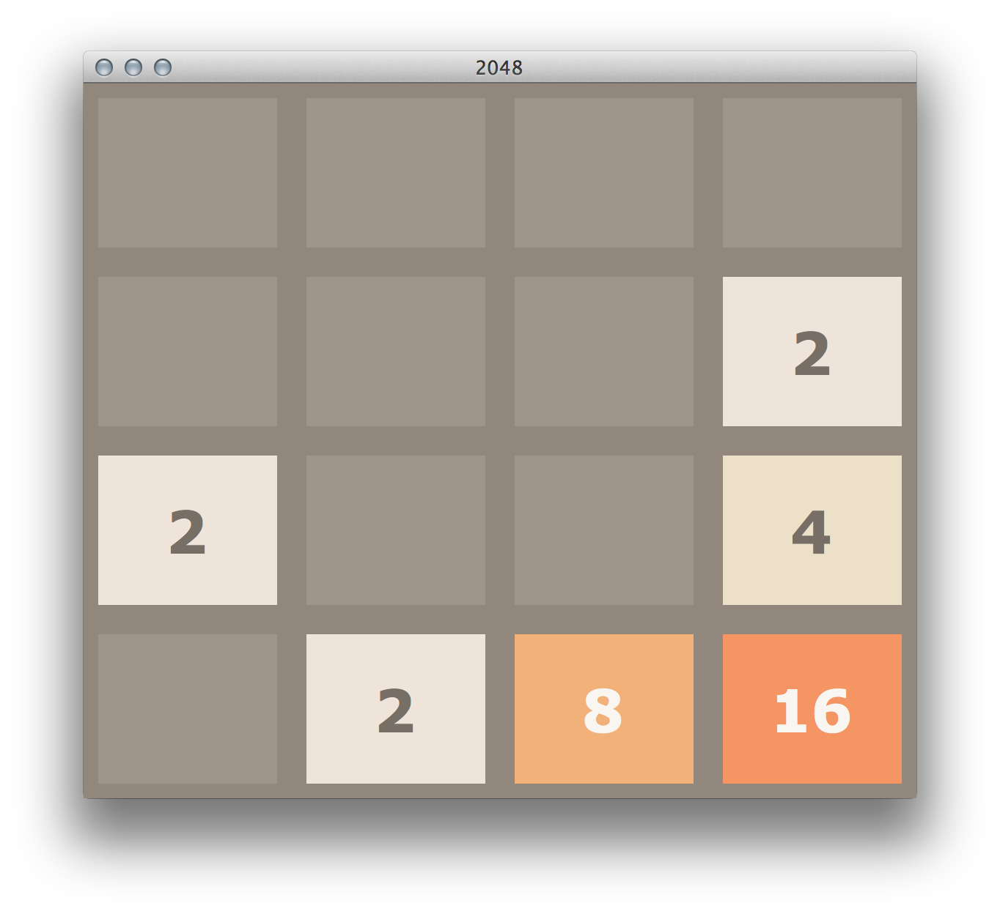

2048 Python & Reinforcement Learning
===========

## Test result

Install dependencies

```bash
pip3 install r requirements.txt
```

Download [pretrained-model from GitHub release](https://github.com/qhduan/rl-2048/releases/tag/model)

Run exists model


```bash
python3 predict.py --model_path models/23_2300000_19177.zip --seed=2979
```

Best seed:

```csv
2979	55503.0
2317	51871.0
2916	50846.0
3316	50488.0
1011	50341.0
1318	50078.0
1905	49991.0
728	49512.0
2860	49408.0
2651	49328.0
3352	48896.0
1353	48862.0
3161	48559.0
819	48360.0
2030	48006.0
2306	47951.0
501	47822.0
2573	47636.0
1603	47590.0
2367	47479.0
```

## Train

```bash
python3 train.py
```

## Readme original:

[](https://repl.it/github/yangshun/2048-python)

---

**⚠️NOTE⚠️**: We won't be accepting any contributions/changes to the project anymore. It is now readonly.

---

Based on the popular game [2048](https://github.com/gabrielecirulli/2048) by Gabriele Cirulli. The game's objective is to slide numbered tiles on a grid to combine them to create a tile with the number 2048. Here is a Python version that uses TKinter! 



To start the game, run:
    
    $ python3 puzzle.py


Contributors:
==

- [Yanghun Tay](http://github.com/yangshun)
- [Emmanuel Goh](http://github.com/emman27)
